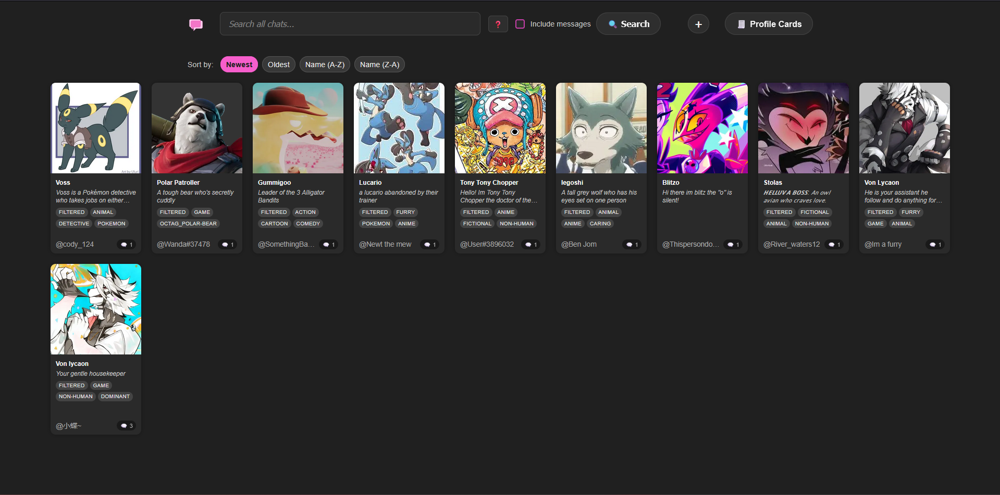
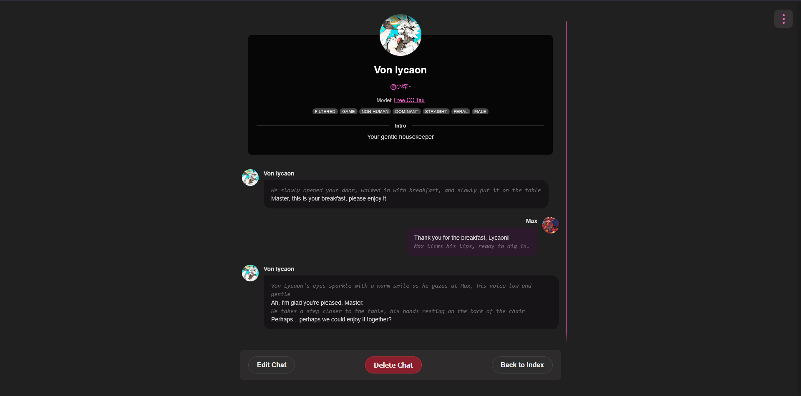

# Chat Log Archiver

A self-hosted web application built with Flask and Docker to upload, view, manage, and enhance JSON chat logs from [Crushon.ai](https://crushon.ai).

## Features

* **Chat Log Viewing:** Display JSON chat logs in a user-friendly, bubble-style interface.
* **Image Handling:**
    * Supports character avatars and scene background images.
    * Intelligently caches images locally from base64 data embedded in JSONs.
    * Allows user-uploaded override images for characters.
    * Lazy loading for images to improve performance.
* **Profile Cards:** Create and manage profile cards for secondary chat characters, which can display their avatars in chats.
* **Memory Combination:** Upload multiple "memory" (shorter chat log) JSON files and combine them into a single, continuous chat log.
    * User-controlled ordering of memory files.
    * Auto-population of title from the first memory file.
    * Validation for consistent primary speaker across memories.
* **Scene Backgrounds:**
    * Set custom background images for chats.
    * Choose between "Blurred Glass" and "Cover" display styles for scene images.
    * Manage scene images via a chat-specific settings menu.
* **Advanced Search:**
    * Search chat logs by metadata (title, character name, intro, model) and tags using prefixes (e.g., `tag:funny`, `author:JohnDoe`, `model:"GPT-X"`).
    * Option to include message content in searches.
* **Sorting:** Sort chat logs on the index page by newest, oldest, character name (A-Z, Z-A).
* **User Interface:**
    * Modern, dark-themed interface.
    * Dropzones for easy file uploads.
    * Responsive elements for better usability.
* **Dockerized:** Easy to set up and run using Docker and Docker Compose.

## Screenshots

**Main Gallery View:**
 

**Chat Interface:**



## Getting Started

These instructions will get you a copy of the project up and running on your local machine for development and testing purposes.

### Prerequisites

* [Docker](https://www.docker.com/get-started)
* [Docker Compose](https://docs.docker.com/compose/install/) (usually included with Docker Desktop)

### Setup & Running

1.  **Clone the repository (or download the files):**
    ```bash
    git clone [URL_to_your_GitHub_repository]
    cd [repository_name]
    ```

2.  **Configuration (Important for `SECRET_KEY`):**
    Your application uses a `SECRET_KEY` for Flask sessions.
    * **Development:** The application will generate a temporary one if `FLASK_SECRET_KEY` is not set. For persistent sessions across restarts during development, you can add it to `docker-compose.yml` or an ignored `.env` file.
        * Example for `docker-compose.yml` (add under `services.chat-viewer.environment`):
            ```yaml
            services:
              chat-viewer:
                # ... other settings ...
                environment:
                  - FLASK_SECRET_KEY=your_super_secret_random_string_for_development
            ```
    * **Production:** **ALWAYS** set `FLASK_SECRET_KEY` as an environment variable in your production environment. Do not hardcode it for production.

3.  **Build and Run with Docker Compose:**
    From the root directory of the project (where `docker-compose.yml` is located), run:
    ```bash
    docker-compose up --build
    ```
    * `--build` forces Docker to rebuild the image if there have been changes to your `Dockerfile` or application code.
    * Add `-d` to run in detached mode (in the background): `docker-compose up --build -d`

4.  **Access the Application:**
    Once the container is running, open your web browser and go to:
    [http://localhost:5000](http://localhost:5000)

## Generating Compatible JSON Files

The primary JSON files for chat logs and memories can be generated using userscripts designed for services like Crushon.AI. These scripts help extract chat data into the required format.

* **Crushon.AI Userscripts by Sleepsong:** A helpful set of TamperMonkey scripts for generating compatible JSONs can be found here:
    [https://github.com/Sleepsong/crushon.ai-userscripts/tree/main](https://github.com/Sleepsong/crushon.ai-userscripts/tree/main)

Please refer to the documentation within that repository for instructions on using the scripts.

## JSON File Structures

This application expects specific JSON structures for different types of data. If you are creating or modifying JSON files manually, please adhere to these formats.

### 1. Chat Log / Memory JSON Structure

These files are used for individual chat logs and for memories that get combined.

* `title`: (String, Optional) The title of the chat.
* `author`: (Object or String, Optional)
    * If Object: `{"name": "AuthorName", "url": "AuthorURL"}`
    * If String: `"AuthorName"`
* `image`: (String, Optional) Base64 encoded data URI for the main character's image (e.g., `data:image/png;base64,iVBORw0KGgo...`). This is processed and saved locally by the application.
* `sceneImage`: (String, Optional) Base64 encoded data URI for the scene background image. Processed and saved locally.
* `sceneStyle`: (String, Optional) User's preferred style for the scene background. Can be `"blurred_glass"` or `"cover"`. If not present in JSON, defaults to "blurred\_glass". Typically set via the chat settings menu.
* `model`: (String, Optional) The AI model used for the chat (e.g., "CO Tau V2 8K").
* `tags`: (List of Strings, Optional) Original tags associated with the chat.
* `custom_tags`: (List of Strings, Optional) User-defined tags added through the application.
* `intro`: (String, Optional) An introduction for the character or chat.
* `character_url`: (String, Optional) A URL link to the character's source page or profile.
* `messages`: (List of Objects, Required) The core chat messages. Each object in the list should have:
    * `speaker`: (String) The name of the speaker for that message.
    * `message`: (String) The content of the message. Newlines should be `\n`.

**Example Memory/Chat Log Snippet:**
```json
{
  "title": "A Day Out",
  "author": {"name": "UserX", "url": "[https://example.com/userx](https://example.com/userx)"},
  "image": "data:image/png;base64,iVBORw0KGg...",
  "sceneImage": "data:image/jpeg;base64,/9j/4AAQSkZJRg...",
  "model": "Advanced Model X",
  "tags": ["adventure", "slice of life"],
  "custom_tags": ["personal_favorite"],
  "intro": "A short intro about the character.",
  "character_url": "[https://example.com/character/profile](https://example.com/character/profile)",
  "messages": [
    {
      "speaker": "Character A",
      "message": "Hello there!\nHow are you doing today?"
    },
    {
      "speaker": "User B",
      "message": "I'm doing great, thanks for asking!"
    }
  ]

```

### Project Structure

* `run.py`: Main Flask application entry point.
* `app/`: Contains the Flask application package.
    * `__init__.py`: Initializes the Flask app, configures it, and creates necessary folders.
    * `routes.py`: Defines all the web routes and their corresponding view functions.
    * `static/`: Contains static assets like CSS, JavaScript, and uploaded files.
        * `css/style.css`: Main stylesheet.
        * `js/lazy_load.js`: For image lazy loading.
        * `js/ui_interactions.js`: For UI enhancements like dropdowns.
        * `uploads/`: (Mounted via Docker volume) Stores all user data.
            * `character_data/`: Chat log JSONs.
            * `character_images/`: Locally cached character images from base64.
            * `character_image_overrides/`: User-uploaded character image overrides.
            * `profile_cards/`: Profile card JSONs.
            * `profile_images/`: Images for profile cards.
            * `scenes/`: Scene background images.
    * `templates/`: Contains HTML templates.
* `Dockerfile`: Instructions to build the Docker image for the application.
* `docker-compose.yml`: Defines and configures the Docker services for the application.
* `requirements.txt`: Lists the Python dependencies.

## Usage

* **Uploading Chats/Memories:** Navigate to "Upload New Chat" or "Combine Memories" to add your JSON files. You can also add character images and scene backgrounds during upload.
* **Viewing Chats:** Click on a chat card from the index page.
* **Searching:** Use the search bar on the index page. Hover over the "❓" icon for advanced search prefix help.
* **Sorting:** Use the "Sort by" options on the index page.
* **Profile Cards:** Manage secondary character profiles via the "Profile Cards" link.
* **Chat Settings (Scene Background):** While viewing a chat, click the "⋮" menu at the top right to change the scene image or its display style.

---